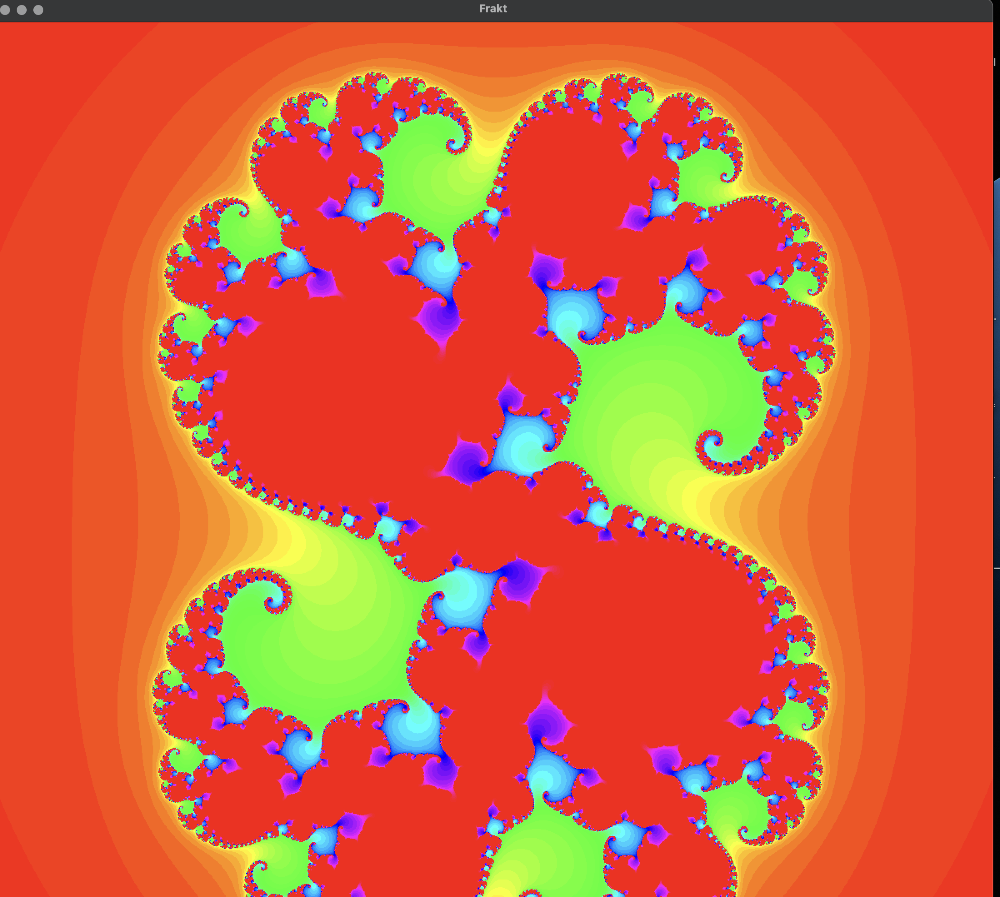
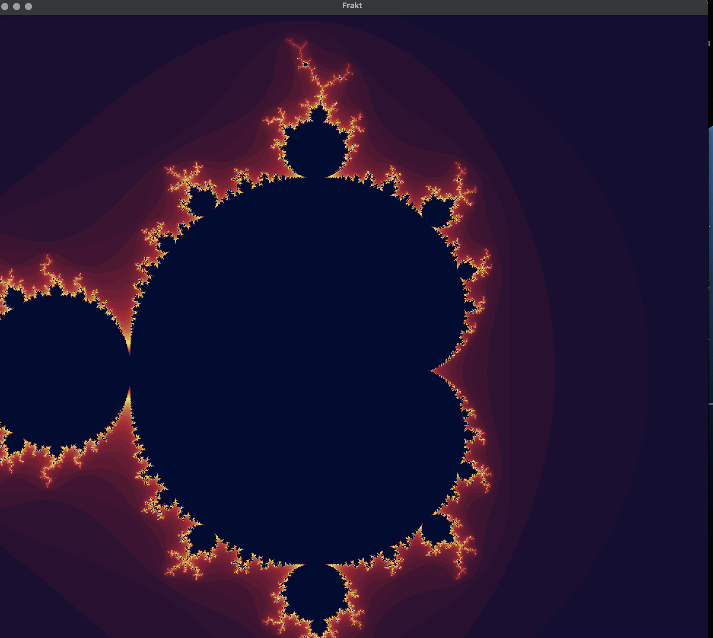
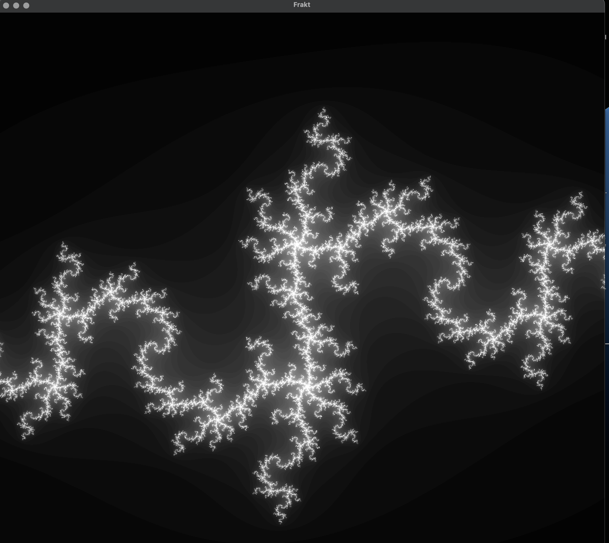

# 🌀 Fraktal Explorer

raktal Explorer is a school project focused on the exploration of fractal geometry and distributed computing. It demonstrates how complex mathematical visualizations can be computed efficiently by distributing tasks across a network of workers.

The system consists of:

- 🧠 A server that manages tasks, assembles computed pixel data, and performs rendering.

- ⚙️ A pool of workers that connect to the server, request tasks, compute fragments of fractals, and send back results.
  This project highlights both:

- The mathematical beauty of fractals
- The practical use of networking and parallel computation

Full project description and resources:

👉 https://github.com/haveneer-training/frakt


## ✨ Features

- Fractals generation (Julia, Mandlbrot, iterated_sin_z and others)
- Distributed Architecture
- Modular Fractal Support
- TCP-Based Networking
- Design Patterns
- Scalable Task Fragmentation


##  🧠 How It Works

🟢 **Server Startup**

The server starts and loads the simulation parameters:
- The type of fractal to generate, along with its specific parameters.
- The coordinates of the viewing window (in the physical space of the fractal).
- The rendering resolution (in pixels)

🔄 **Main Loop**

- The server listens on port 8787 (by default) for incoming worker connections.
- The process continues until the server is manually stopped.

🤝 **Server–Worker Communication**
- A worker initiates communication by requesting a task `FragmentRequest`
- The server responds with a task containing `FragmentTask`
    -  A unique task ID.
    - Fractal descriptor and parameters.
    - Physical-space coordinates of the requested render area.
    - Rendering resolution (in pixels).
- After computation, the worker sends back `FragmentResult``
    - The same task ID.
    - The coordinates and resolution from the original task.
    - A list of computed pixel intensities.


##  ✅ Requirements
- Rust (stable)
- Cargo (comes with Rust)

##  ⚡️ Getting started
- Clone the repository
```bash
git clone https://github.com/Mazene-ZERGUINE/fraktal_explorer
```

- Build the project
```bash
cargo build --release
mkdir -p bin
cp target/release/fraktal_explorer bin/
````

- Run the server
  the server is already provided with 3 versions for macos, linux and window in `./bin/server`

```bash
./bin/server/{your_distribution}
```

- Rune the worker
```bahs
./bin/fraktal_explorer
````

- Run the command
```bash
worker connect localhost:8787 
```

and use the keyboard button `c` to change between fracals

## 🖼️ Previews

### 🔹 Julia Set


### 🔹 Mandelbrot Zoom


### 🔹 Newton-Raphson z³



## 👨‍💻 Authors

- **[Mazene ZERGUINE](https://github.com/Mazene-ZERGUINE)**
- **[ZHU Loic](https://github.com/LoicZHU)**

